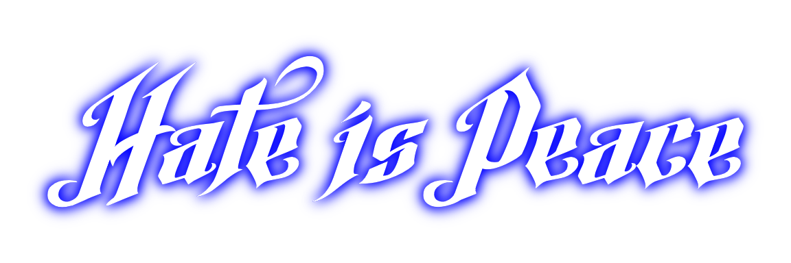

# 

Hate is Peace is a first-person shooter sandbox game using Amnesia: The Dark Descent's engine. While the engine may be very unusual to work with for a first-person shooter game, I believe that it should be more appropriate and fit for the long run, as it has easy-to-use developer tools for modders and some documentation. Maybe it could be, who knows

## Characters
### Main
#### Roozer
This is the main self-insert of Hate is Peace. Roozer is a powerless but brave young man, with blue hair and a suit. Usually, he is pretty introverted and no one really talks to him except Sarven and his friend Alice. He is around 5 feet and 4 inches tall, or 163 centimeters

#### Sarven
A tall but wonderful demon with the heart of an angel, Sarven is Roozer's significant other. She can be used as a companion in single-player missions, to revive after dying, or to blow some steam off in the bedroom. She is around 7 feet and 3 inches tall, or 220 centimeters

#### Alice
Alice is a weapons merchant and runs a store in the town, where she can be used to buy, sell and repair items, along with armor from Roozer's inventory. She is around 5 feet and 2 inches tall, or 157 centimeters

### Bosses
#### Mecha-Maily + Jonathan Vaghaun
A creation from the mind of a madman, Mecha-Maily/Mailman is a machine and a monster at the same time. Originally, he used to be tortured a lot by Willow simply because he was being a dumb freak and a wimp. Now with Mr. Vaghaun's efforts, he has been turned into a slaughter machine. Willow has absolutely feared this creation ever since, and never came back pestering Maily ever again

Maily is equipped with a rocket launcher, a laser and a machine gun on his arms. Part of his face are missing meat and eyes, so part of it shows his skull in the inside. In the game, there should be a mission that Willow can give to Roozer and Sarven, which is killing Maily along with its creator

#### Simon
What used to be Willow's iMessage fuckboy and femboy, Simon has now turned into a cheap bootleg knockoff of Davoth from DOOM Eternal :) Apparently, this boy is skinny weak and loves to wear maid outfits, while also busting to Chongyun x Xingqiu ships (I'll just call it Wang x Wong, simply because all these Chinese names are so God damn hard to pronounce for American tongues)

Sarven and Roozer both hate this guy because of all the damage that he had done to Roozer, so they have all the right reasons to break his bones and kill him. Thankfully he is pretty weak, so it shouldn't be too much of a big deal showing the chinks in his armor by simply shooting him with a pea shooter. Which is obviously very funny, and makes Roozer and Sarven die laughing together whenever they attempt to destroy his "armor"

### Miscellany
#### Willow
A quiet and dormant but open-minded old friend of Roozer, Willow is Sarven's biggest fear. Even though she has never hurt anyone or doesn't mean to give out any bad intentions at all, Sarven can be easily scared and will immediately run away by her appearance

There's a reason why Sarven could run away from Willow. Firstly, for some reason she can sometimes come off as intimidating especially whenever she is around. Secondly, she can also sometimes go feral if things ever piss her off or make her angry. Lastly, it's usually recommended that people don't mess with her. Whatever they do, she means very serious business, and she really means it

## For developers and modders
### Directory structure
Hate is Peace utilizes a directory structure akin to that of Amnesia: The Dark Descent (because it uses the same engine duh):
- `addons` - User-created content, mods or Add-Ons
- `billboards` - Godray textures for lights
- `config` - Default game parameters and settings, as well as languages
- `core` - Information required to render the whole game along with test shapes and objects
- `fonts` - Information required to render the text on the screen
- `graphics` - 2D sprites that can be used to render HUD objects, as well as wallpapers
- `gui` - Information and 2D sprites required for the game's user interface
- `maps` - All the maps for Hate is Peace
- `models` - Models for characters, as well as weapons among other things
- `objects` - Quite literally, `static_objects` and `entities` combined into one folder
- `particles` - Particle effects for the game world
- `shaders` - Additional shaders for some in-game effects
- `sounds` - All the sound effects + the full music tracks/soundtrack
- `textures` - Cubemaps/Skyboxes, effects and water textures

### Development Tools and SDK
Hate is Peace also has the following developer tools. Most of them are WYSIWYG (What you see is what you get) editors:
- **(NEW)** `HpsEditor` - Block-based tool used to create, edit and save script files for maps 
- **(NEW)** `LangEditor` - Used to create, edit and save language files
- **(NEW)** `SntEditor` - Used to create, edit and save sound files
- **(NEW)** `SkinEditor` - Used to create, edit, and save gui/skin files
- `EntityEditor` - Used to create, edit and view entities/objects
- `EntityViewer` - Used to view and play around with entities
- `LevelEditor` - Used to create, edit and view maps/levels
- `LevelViewer` - Used to view maps/levels
- `MaterialEditor` - Used to create, edit and view texture maps for primitives or objects
- `ParticleEditor` - Used to create, edit and view particle effects

## Creation
These are the tools I use to craft Hate is Peace. All of them can be obtained by downloading, buying or pirating them if you're devious enough

### Code
- [Notepad++](https://notepad-plus-plus.org/) - for editing HPS/Lang/txt/etc. files
- [GitHub Desktop](https://desktop.github.com/) - for pushing code and commits
- [Visual Studio 2022](https://visualstudio.microsoft.com/vs/) - for editing the source code lol

### Graphics
- [Paint.net](https://getpaint.net/) - for creating, editing and saving textures/sprites

### Models
- [Blender](https://www.blender.org/) - this tool is mainly for sculpting meshes. All models must be exported to the OBJ file format
- Maya 2011 - This tool is for importing and rigging meshes which can be ready to use for the game. Legitimate copies of this specific version of Maya are incredibly hard to find, so I just use a cracked version anyway. Sorry and Thanks Autodesk :(

I use a plugin for Maya 2011 called OpenCOLLADA which can export models using the appropriate version of Collada/DAE; version 1.4.1 is highly recommended as newer versions tend to severely (and irreversibly, if you're not careful) corrupt animations upon export

### Sounds and Music
- [WavePad](https://www.nch.com.au/wavepad/index.html) - for creating, editing and saving sounds for Hate is Peace
- [Audacity](https://archive.org/details/audacity-2.4.2) - for editing sounds in ways that WavePad absolutely can't
- [FL Studio](https://www.image-line.com/) - for creating, editing and saving music tracks for Hate is Peace
